# FoodX — Toàn bộ sơ đồ UML dạng Mermaid (dán vào draw.io)

Mục lục: 0. Kiến trúc · 1. Use Case tổng quát · 2. Use Case phân rã · 3. Biểu đồ lớp ·
4. Hoạt động (autoFill) · 5. Tuần tự (Chat AI) · 6. Component · 7. Triển khai ·
8. Trạng thái ×3 · 9. Tuần tự bổ sung ×3 · 10. Hoạt động (Import) · 11. ER

## Cách nhập vào draw.io

1. Mở draw.io (app.diagrams.net hoặc bản desktop).
2. Chọn **Extras → Mermaid...** (một số phiên bản: dialog tạo mới có thẻ *Mermaid*, hoặc *File → New → Mermaid*).
3. Xóa nội dung mặc định, dán **một** khối `mermaid` bên dưới, nhấn **Insert / OK**.
4. draw.io tự layout — kéo lại cho gọn (vị trí sinh ra có thể chưa đẹp như bản SVG gốc).

### Lưu ý tương thích

- Nếu báo lỗi parse: xóa dòng `direction TB` / `direction LR` (trong `subgraph` hoặc `stateDiagram`) rồi thử lại.
- Mermaid không có diagram type Use Case riêng → Use Case dùng node ellipse `([...])` + `subgraph` làm khung hệ thống.
- Không dùng `classDef` / `style` / `linkStyle` để tránh lệch khi convert sang mxGraph.
- Nếu `erDiagram` không import được trên bản draw.io cũ, báo lại — sẽ chuyển sang dạng bảng.

---

## 0. Kiến trúc tổng quát

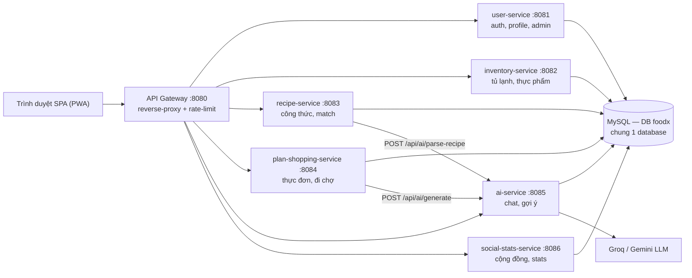

---

## 1. Use Case tổng quát

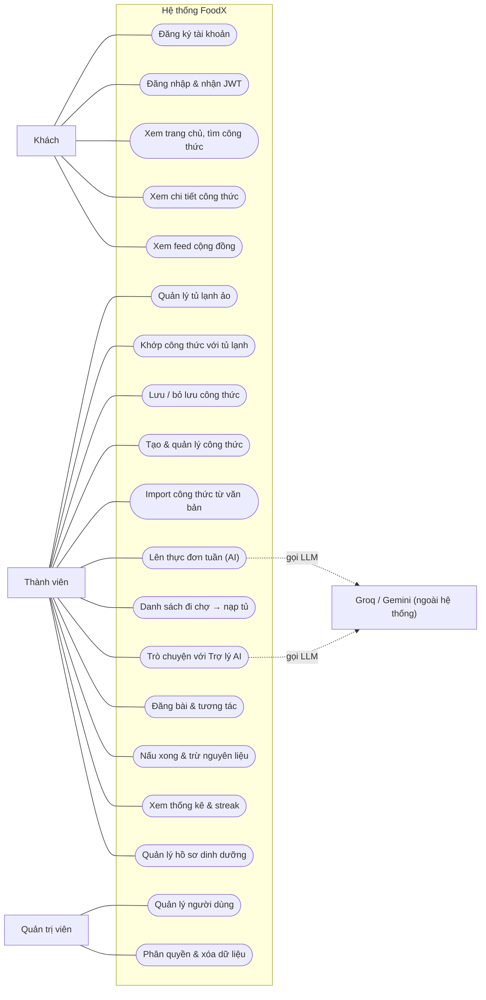

---

## 2. Use Case phân rã

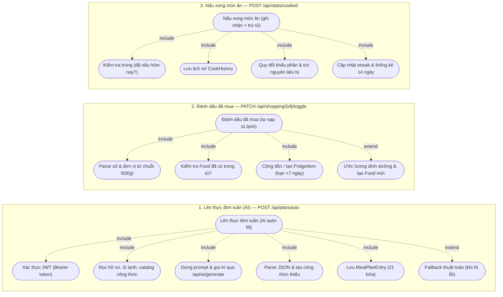

---

## 3. Biểu đồ lớp

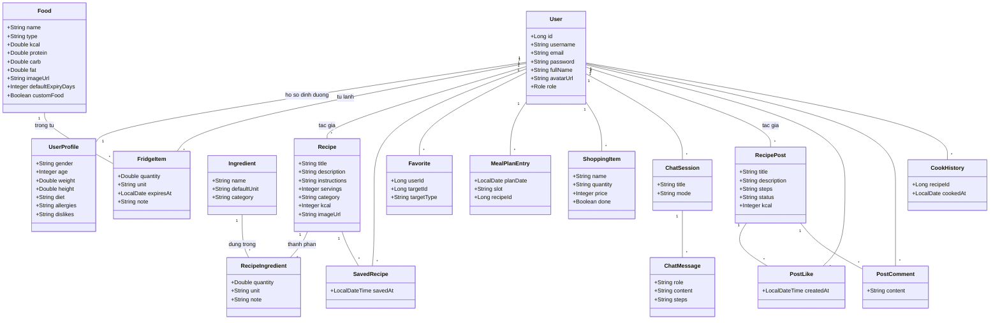

---

## 4. Biểu đồ hoạt động — Tự động lên thực đơn tuần

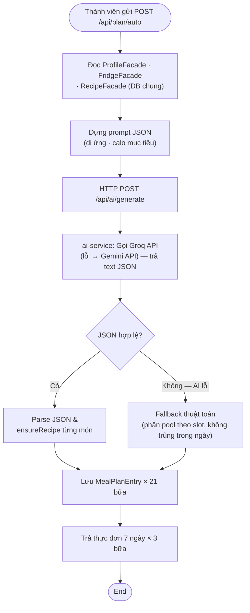

---

## 5. Biểu đồ tuần tự — Chat AI đa phiên

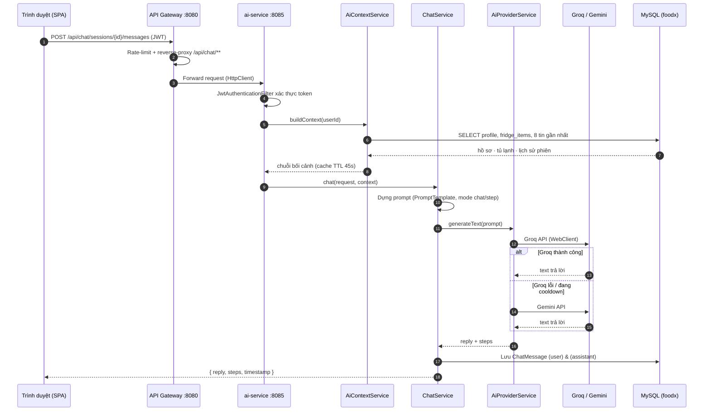

---

## 6. Biểu đồ thành phần

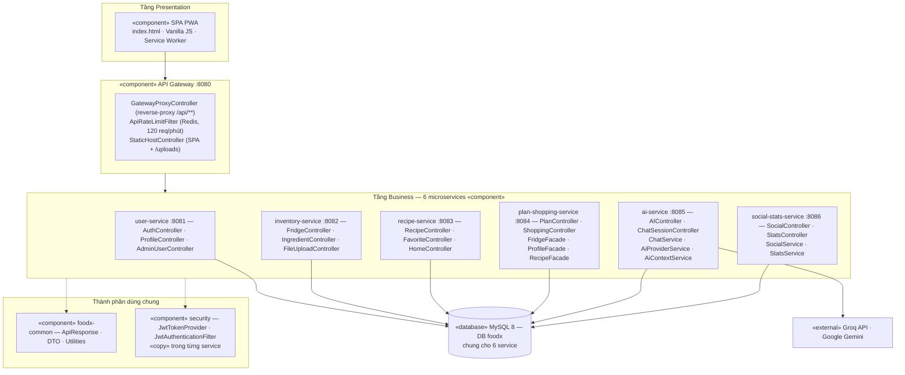

---

## 7. Biểu đồ triển khai

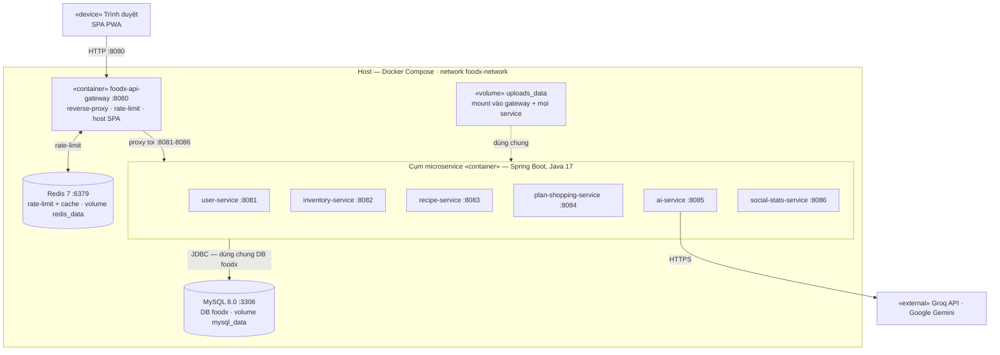

---

## 8. Biểu đồ trạng thái (3 sơ đồ)

### 8.1 RecipePost

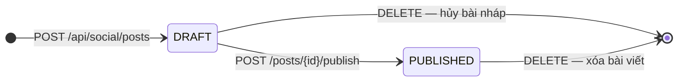

### 8.2 ShoppingItem

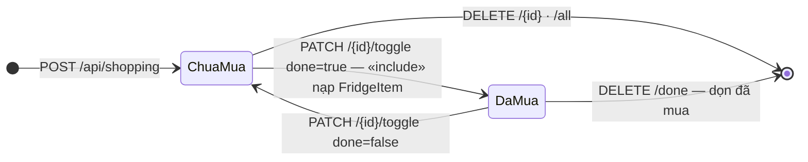

### 8.3 FridgeItem

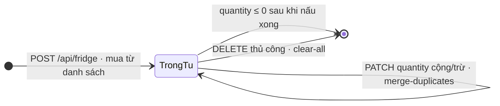

---

## 9. Biểu đồ tuần tự bổ sung

### 9.1 Đăng nhập & phát hành JWT

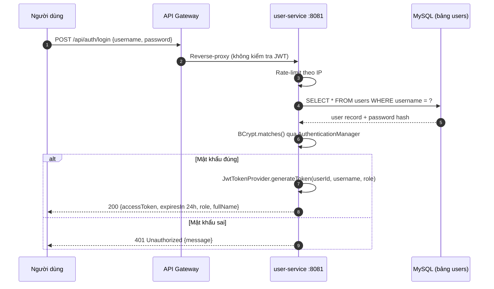

### 9.2 Tick "đã mua" → tự nạp tủ lạnh

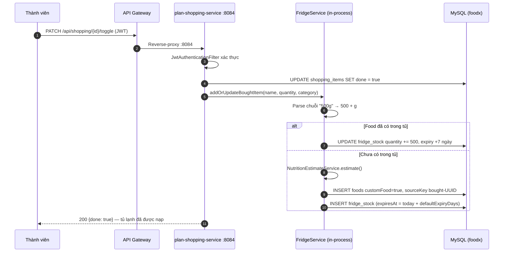

### 9.3 "Nấu xong" → trừ nguyên liệu tủ & cộng streak

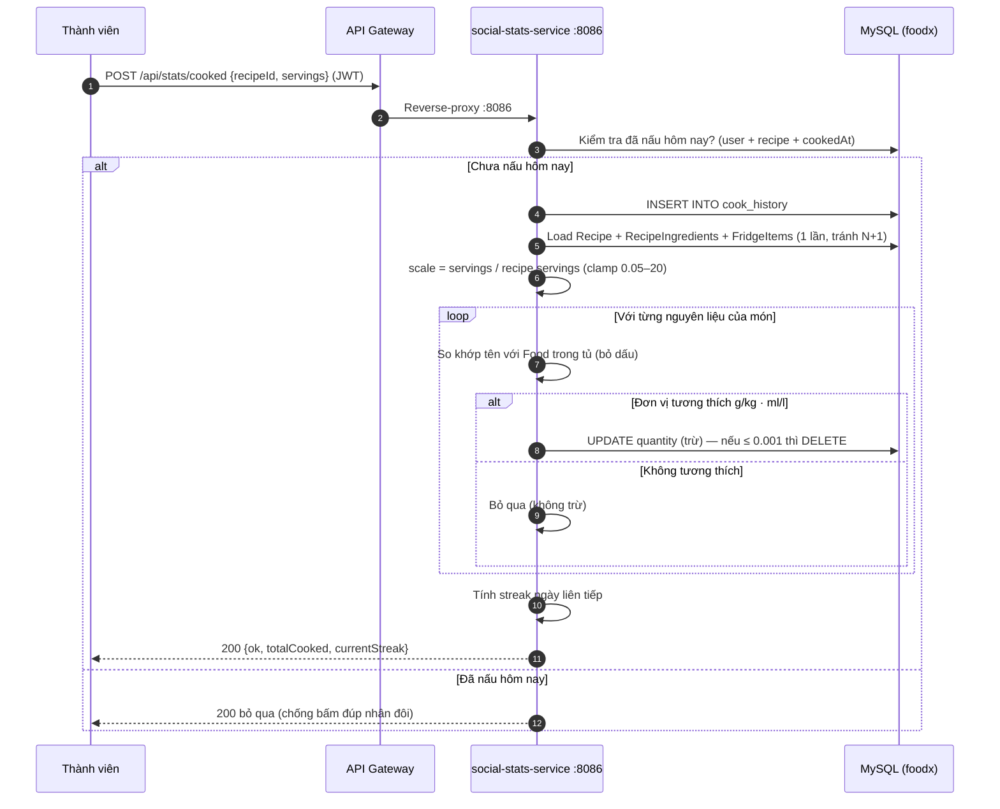

---

## 10. Biểu đồ hoạt động — Import công thức từ văn bản

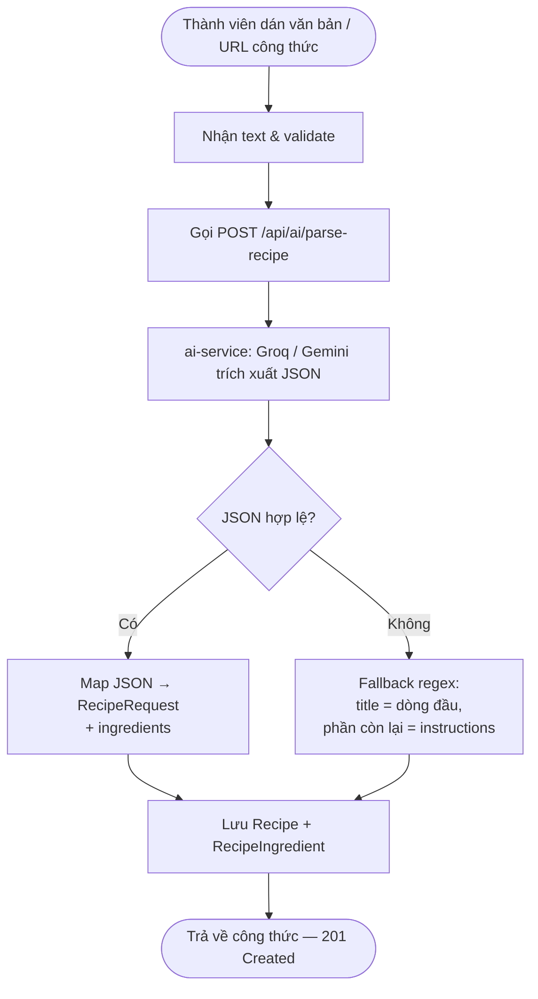

---

## 11. Biểu đồ quan hệ dữ liệu (ER)

```mermaid
erDiagram
    users {
        bigint id PK
        varchar username UK
        varchar email UK
        varchar password
        varchar role
    }
    profiles {
        bigint id PK
        bigint user_id FK
        varchar gender
        varchar diet
        varchar allergies
        varchar dislikes
    }
    foods {
        bigint id PK
        varchar source_key UK
        varchar name
        double kcal
        integer default_expiry_days
        boolean custom_food
    }
    fridge_stock {
        bigint id PK
        bigint user_id FK
        bigint food_id FK
        double quantity
        varchar unit
        date expires_at
    }
    ingredients {
        bigint id PK
        varchar name UK
        varchar default_unit
        varchar category
    }
    recipes {
        bigint id PK
        bigint author_id FK
        varchar title
        varchar category
        integer kcal
        varchar image_url
    }
    recipe_ingredients {
        bigint id PK
        bigint recipe_id FK
        bigint ingredient_id FK
        double quantity
        varchar unit
    }
    meal_plan_entries {
        bigint id PK
        bigint user_id FK
        date plan_date
        varchar slot
        bigint recipe_id
    }
    shopping_items {
        bigint id PK
        bigint user_id FK
        varchar name
        varchar quantity
        boolean done
    }
    chat_sessions {
        bigint id PK
        bigint user_id FK
        varchar title
        varchar mode
    }
    chat_messages {
        bigint id PK
        bigint session_id FK
        varchar role
        text content
    }
    recipe_posts {
        bigint id PK
        bigint author_id FK
        varchar title
        varchar status
        integer kcal
    }
    post_likes {
        bigint id PK
        bigint user_id FK
        bigint post_id FK
    }
    post_comments {
        bigint id PK
        bigint user_id FK
        bigint post_id FK
        text content
    }
    cook_history {
        bigint id PK
        bigint user_id FK
        bigint recipe_id
        date cooked_at
    }
    saved_recipes {
        bigint id PK
        bigint user_id FK
        bigint recipe_id FK
        datetime saved_at
    }

    users ||--|| profiles : "1-1 ho so"
    users ||--o{ fridge_stock : "1-N tu lanh"
    foods ||--o{ fridge_stock : "1-N trong tu"
    users ||--o{ recipes : "1-N tac gia"
    recipes ||--o{ recipe_ingredients : "1-N thanh phan"
    ingredients ||--o{ recipe_ingredients : "1-N dung trong"
    users ||--o{ meal_plan_entries : "1-N ke hoach"
    users ||--o{ shopping_items : "1-N di cho"
    users ||--o{ chat_sessions : "1-N phien chat"
    chat_sessions ||--o{ chat_messages : "1-N tin nhan"
    users ||--o{ recipe_posts : "1-N bai viet"
    recipe_posts ||--o{ post_likes : "1-N like"
    users ||--o{ post_likes : "1-N like"
    recipe_posts ||--o{ post_comments : "1-N comment"
    users ||--o{ post_comments : "1-N comment"
    users ||--o{ cook_history : "1-N lich su nau"
    users ||--o{ saved_recipes : "1-N da luu"
    recipes ||--o{ saved_recipes : "1-N duoc luu"
```

> `favorites` không có trong ER (lưu `userId/targetId` dạng thường, không FK — yêu thích đa hình cho công thức và nguyên liệu). `meal_plan_entries.recipe_id` và `cook_history.recipe_id` cũng là soft reference, không FK.

---

## Ghi chú ánh xạ với báo cáo

| Sơ đồ | Dạng mermaid | Nguồn gốc |
|---|---|---|
| Use Case tổng quát, phân rã | `flowchart` (ellipse `([...])` + subgraph) | chuyển từ SVG |
| Hoạt động ×2, Triển khai | `flowchart` (bỏ swimlane — mermaid không có) | chuyển từ SVG |
| L lớp, Component, ER | `classDiagram` / `flowchart` / `erDiagram` | giữ nguyên |
| Tuần tự ×4 | `sequenceDiagram` | giữ nguyên |
| Trạng thái ×3 | `stateDiagram-v2` | giữ nguyên |

Nếu khối nào draw.io báo lỗi, gửi lại thông báo lỗi — đó thường là do phiên bản mermaid cũ (`direction`, `erDiagram`); mình sẽ viết lại dạng tương thích.
