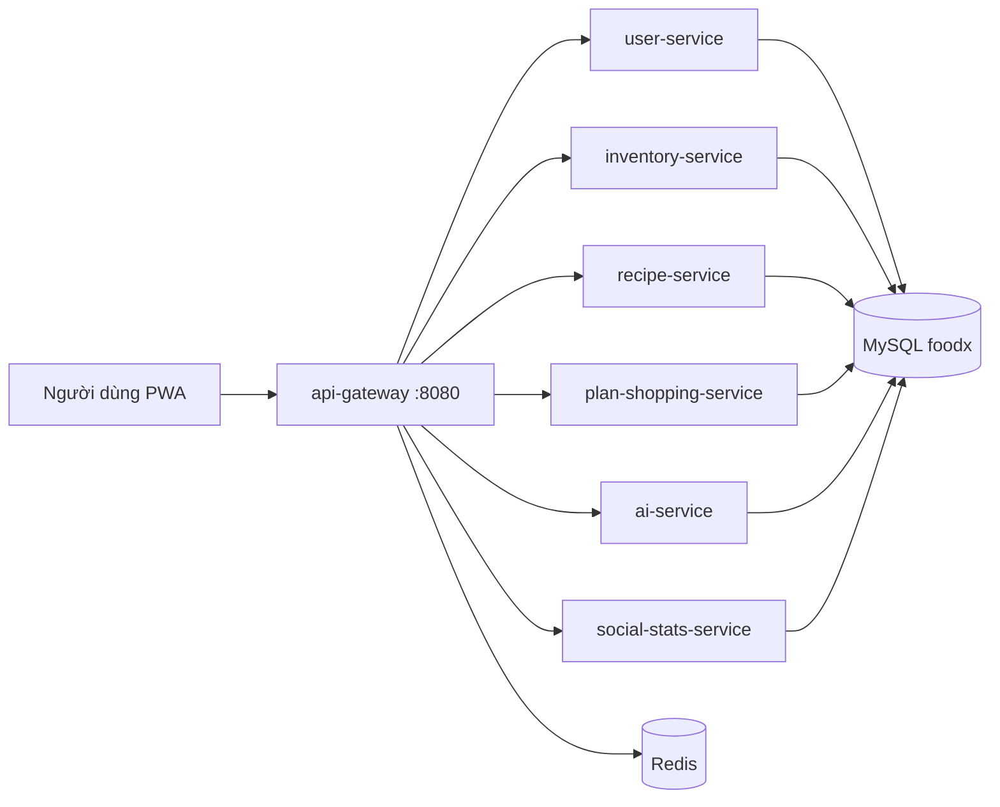

# FoodX — Trả lời câu hỏi kiến trúc & nghiệp vụ

> Tài liệu trả lời theo **dự án FoodX** (repo `lamitk5/foodx`, nhánh tích hợp `master`): Spring Boot microservices + API Gateway `:8080`, MySQL `foodx`, Redis (rate limit), SPA PWA.
>
> Tham chiếu nhanh: [Readme.md](../Readme.md), [db/database-design.md](../db/database-design.md), [API_DOCUMENTATION.md](../API_DOCUMENTATION.md).

---

## 1. Vì sao nhóm chọn kiến trúc này?

FoodX chọn **microservices theo domain** + **API Gateway** + **frontend SPA** vì:

| Lý do | Áp dụng trong FoodX |
|--------|---------------------|
| **Phân công nhóm** | Mỗi thành viên một miền: auth/profile (Hạnh), tủ/kế hoạch/đi chợ (Thảo), công thức/cộng đồng (Đăng), AI/gateway/admin (Lâm). Mỗi service deploy port riêng (`8081`–`8086`). |
| **Tách tải & rủi ro** | Gọi LLM (Groq/Gemini) chậm/treo → gom vào `ai-service` (`:8085`) với bulkhead (`AiRequestGate`), không kéo sập toàn bộ auth/tủ lạnh. |
| **Một cửa cho client** | Trình duyệt/PWA chỉ gọi `http://localhost:8080/api/**`; gateway route theo path (`GatewayProxyController`). |
| **Phù hợp đồ án** | Vừa thể hiện kiến trúc phân tán, vừa giữ một DB MySQL chung giai đoạn đầu (triển khai nhanh, JPA `ddl-auto=update`). |

Kiến trúc **không phải** “microservices thuần” ở tầng dữ liệu: hiện **các service cùng schema MySQL `foodx`**, nhiều module (auth, fridge, profile…) được **copy** vào từng service — đây là trade-off có chủ đích (xem câu 11).

---

## 2. Nếu kiến trúc theo kiểu này, xử lý giao dịch (transaction) có khác không? Có dễ hơn không?

**Có — khác hẳn monolith một DB một process.**

| Monolith | Microservices (lý thuyết) | FoodX hiện tại |
|----------|---------------------------|----------------|
| Một `@Transactional` có thể bao nhiều bảng/module | **Không có transaction phân tán mặc định** giữa service A và B (2PC/Saga phải thiết kế thêm) | Nhiều bước nghiệp vụ nằm **trong một service** vẫn dùng `@Transactional` local (ví dụ đi chợ → tủ lạnh, cùng `plan-shopping-service`) |
| Rollback “tất cả” đơn giản | Phải **compensating action**, idempotency, outbox/event | Gọi HTTP qua gateway **không** gộp transaction; lỗi giữa hai request → có thể **lệch dữ liệu** nếu frontend gọi nhiều API tuần tự |

**Dễ hơn** khi: scale từng phần, team sửa song song, cô lập AI.

**Khó hơn** khi: cần **nhất quán xuyên service** (mua xong + cập nhật kế hoạch + trừ tủ + ghi stats) — phải thêm Saga, message queue, hoặc gom use-case vào một service/ một transaction local.

---

## 3. Thực thể trung tâm của dự án là gì? Xuất hiện ở model nào? Mỗi nơi cần thuộc tính gì?

### 3.1. Thực thể trung tâm: **User (người dùng)** và **Recipe / Food (ẩm thực)**

Mọi tính năng xoay quanh **một tài khoản** quản lý **tủ lạnh**, **kế hoạch**, **công thức**, **cộng đồng**, **AI**.

### 3.2. Bảng / entity chính theo service

| Thực thể | Service / bảng JPA | Thuộc tính cần ở nơi đó |
|----------|-------------------|-------------------------|
| **User** | `user-service` → `users`; entity `User` cũng có trong các service khác (đọc JWT + FK) | `username`, `email`, `password` (hash), `role` (USER/ADMIN), thời gian tạo/sửa |
| **UserProfile** | `profiles` (user-service) | Giới tính, tuổi, cân/nặng, chiều cao, `activity`, TDEE/calo mục tiêu, onboarding — phục vụ gợi ý & AI |
| **Food** (catalog dinh dưỡng) | inventory / `foods` | Tên, loại, kcal, protein/carb/fat, ảnh, thành phần |
| **FridgeItem** | inventory → `fridge_stock` | `user_id`, liên kết `Food`, `quantity`, `unit`, `expiresAt`, ghi chú |
| **Recipe** | recipe-service → `recipes`, `recipe_ingredients` | Tiêu đề, mô tả, bước nấu, thời gian, khẩu phần, ảnh, `author` |
| **Favorite** | recipe-service → `favorites` | `userId`, `targetId`, `targetType` (RECIPE/INGREDIENT) — chỉ tham chiếu |
| **Meal plan** | plan-shopping → `meal_plan_entries` | `user_id`, ngày, bữa, `recipe_id`, khẩu phần |
| **ShoppingItem** | plan-shopping → `shopping_items` | `user_id`, tên, số lượng, giá, category, cờ `done` |
| **RecipePost** (social) | social-stats → `recipe_posts` | Tác giả, nội dung chia sẻ, trạng thái nháp/xuất bản, like/comment |
| **ChatSession / ChatMessage** | ai-service | `user_id`, tiêu đề phiên, lịch sử tin nhắn AI |

**Quy ước quan trọng:** API nghiệp vụ lấy `user` từ **JWT + `SecurityUtils.getCurrentUser()`**, không tin `userId` client gửi tùy ý (xem câu 7).

---

## 4. Một thay đổi nghiệp vụ buộc sửa nhiều module/dịch vụ — kèm lý do

**Ví dụ nhóm chọn:** *“Bắt buộc lọc món/công thức theo **dị ứng & ngưỡng calo** lấy từ hồ sơ (profile), áp dụng thống nhất ở trang chủ, khớp tủ, kế hoạch tuần và Trợ lý AI.”*

| Nơi phải sửa | Vì sao |
|--------------|--------|
| **user-service** (`UserProfile`) | Nguồn sự thật: danh sách dị ứng, calo/TDEE |
| **recipe-service** (`/api/recipes/match`, home) | Logic khớp tủ + lọc công thức |
| **plan-shopping-service** | Sinh thực đơn tuần / gợi ý mua theo profile |
| **ai-service** (`AiContextService`) | Prompt AI cần profile + tủ + ràng buộc dị ứng |
| **api-gateway + SPA** (`app.js`, `modules/home.js`, `plan.js`, `onboarding.js`, `chat.js`) | Hiển thị, validate, gọi đúng API |
| (Tuỳ chọn) **inventory** | Gắn allergen vào catalog `foods` / nguyên liệu |

**Lý do cốt lõi:** trong microservices, **cùng một quy tắc nghiệp vụ** thường **không nằm một chỗ** — dữ liệu profile ở service A, match recipe ở B, AI ở C, UI gọi qua gateway. Đổi quy tắc = **đồng bộ hợp đồng API + logic + giao diện**.

---

## 5. Một thao tác cập nhật dữ liệu nhiều bước — bước 2 lỗi thì dữ liệu xử lý thế nào?

### Trường hợp A — **Trong một service, một transaction** (FoodX đã làm)

**Ví dụ:** đánh dấu “đã mua” trên danh sách đi chợ (`ShoppingService.toggle`):

1. Cập nhật `shopping_items.done = true`
2. Gọi `FridgeService.addOrUpdateBoughtItem` nạp tủ

Cả hai nằm trong **`@Transactional` cùng `plan-shopping-service`, cùng MySQL** → nếu bước 2 ném exception, **rollback bước 1**, dữ liệu nhất quán.

### Trường hợp B — **Nhiều HTTP qua gateway** (frontend gọi tuần tự)

**Ví dụ:** upload ảnh (`inventory-service`) rồi cập nhật công thức có `imageUrl` (`recipe-service`).

- Gateway **không** điều phối transaction xuyên service.
- Nếu bước 1 OK, bước 2 lỗi → **ảnh đã lưu**, công thức chưa trỏ URL → **trạng thái dở dang**.
- Cách xử lý nhóm đề xuất / hướng cải thiện: API **một bước** phía backend, **Saga** (bước bù: xóa file), hoặc job dọn rác upload orphan.

### Trường hợp C — **Admin xóa user** (`AdminUserController.cleanUserData`)

Xóa dữ liệu liên quan bằng **JdbcTemplate trong một `@Transactional`** trên user-service (nhiều bảng: social, chat, fridge, plan, favorites…). Lỗi giữa chừng → rollback toàn bộ trong transaction đó.

---

## 6. Hai người cùng tranh “một chỗ cuối cùng” — nhóm xử lý thế nào?

### Ví dụ 1 — **Slot gọi AI (bulkhead)** — có trong code

`ai-service` dùng `AiRequestGate` (semaphore, `app.ai.max-concurrent`, timeout chờ ~3s):

- Chỉ **N** request AI chạy song song.
- Người thứ N+1 **không chiếm slot vô hạn**: sau timeout nhận **503** *“AI đang bận — quá nhiều người hỏi cùng lúc…”*.
- Người dùng: thử lại; gateway vẫn trả JSON lỗi, không treo vô thời hạn (gateway timeout downstream ~60s).

### Ví dụ 2 — **Cùng like một bài**

`PostLike` có **`UNIQUE (user_id, post_id)`** + service kiểm tra `existsByPost_IdAndUser_Id` trước khi insert → like trùng **không tạo hai dòng**; API toggle bật/tắt.

### Ví dụ 3 — **Cùng trừ số lượng tủ lạnh** (hạn chế hiện tại)

`changeQuantity` đọc-sửa-ghi **không có optimistic lock / version** → hai tab cùng trừ có thể **lost update**. Hướng sửa: `@Version`, hoặc `UPDATE ... WHERE quantity >= :need`.

---

## 7. Giả sử A đăng nhập tài khoản A, đổi `id` thành B để xem dữ liệu B — điều gì xảy ra? Nhóm xử lý ra sao?

### Kịch bản thường gặp

1. **Sửa `userId` trong body/query** (Postman/DevTools)  
2. **Tự sửa claim `uid` trong JWT** nhưng giữ subject username của A  

### Hành vi FoodX

| Cách tấn công | Kết quả |
|---------------|---------|
| Gửi `userId=B` trong body | Controller dùng **`securityUtils.getCurrentUser()`** từ JWT (ví dụ `FridgeController.getAll`, `ProfileService`…) → chỉ thao tác dữ liệu **user A**. |
| JWT hợp lệ của A, sửa claim `uid` → B | Filter lấy **username từ `sub`**, load user A từ DB (`JwtAuthenticationFilter` + `UserDetailsServiceImpl`) → **bỏ qua uid giả** trong claim tùy chỉnh khi authorize. |
| Dùng token của B (đánh cắp) | Xem được dữ liệu B — đây là **lộ token**, không phải IDOR; cần bảo vệ token (HTTPS, httpOnly nếu cookie, không log token). |
| Truy cập `/api/fridge/{id}` của B | `findFridgeItem(user, id)` theo **A’s user_id** → **404** nếu id không thuộc A. |
| Bài social nháp của B | `getPost`: nháp chỉ tác giả xem → A nhận **404**. |

**Tóm lại:** nhóm chống **IDOR** bằng **không tin tham số user từ client** + **kiểm tra sở hữu** (`findByIdAndUser_Id`, `requireAuthor`).

---

## 8. Làm sao thu hồi quyền của một người khi JWT còn hạn?

JWT stateless **mặc định vẫn dùng được đến hết hạn** (`app.jwt.expiration-ms=86400000` ≈ 24h) nếu không có cơ chế bổ sung.

### FoodX đang làm

- Mỗi request, filter **load lại user từ DB** theo username → **đổi `role` trên DB** (admin hạ quyền) **có hiệu lực ngay** trên request tiếp theo (authority `ROLE_*` mới).
- **Logout phía client:** xóa token trong SPA (`auth.js` / `app.js`) — server **chưa** có API blacklist token.

### Thu hồi quyền triệt để (nhóm đề xuất nếu còn thời gian)

| Biện pháp | Tác dụng |
|-----------|----------|
| **Redis denylist** (jti / hash token) | Từ chối token dù còn hạn |
| **Đổi mật khẩu / `tokenVersion` trên User** | JWT cũ fail khi version không khớp |
| **Rút ngắn TTL + refresh token** | Thu hồi nhanh hơn |
| **Xóa user** (`DELETE /api/admin/users/{id}`) | User không còn trong DB → request sau **401/403** |

---

## 9. Người dùng → dịch vụ A → gọi sang dịch vụ B; B phản hồi chậm — A và người dùng thấy gì?

Trong FoodX, **trình duyệt hầu hết gọi gateway → một service downstream** (không chain A→B qua HTTP nội bộ). Luồng tương đương:

### Frontend → Gateway → Service chậm (ví dụ **ai-service**)

| Thành phần | Hành vi |
|------------|---------|
| **Gateway** | `HttpClient` timeout **60s**; lỗi/timeout → **503** JSON *“Service Unavailable”* (`GatewayProxyController`). |
| **ai-service** | Gọi Groq/Gemini qua WebClient (timeout ~20s), **`AiRequestGate`** giới hạn đồng thời; quá tải → **503** sớm (~3s chờ slot). |
| **Người dùng** | UI loading; nhận lỗi 503/504 hoặc message nghiệp vụ *“AI đang bận”*; có thể fallback Groq → Gemini trong service (nếu cấu hình). |

### Nếu thiết kế A gọi B nội bộ (tương lai)

- **A** nên timeout ngắn hơn client, **circuit breaker**, trả lỗi có ý nghĩa (degraded mode).
- **User** không nên chờ tổng (timeout A + timeout B); nên **async** hoặc cache.

Gateway còn **`spring.mvc.async.request-timeout=90000`** cho request dài (chat AI).

---

## 10. Một dịch vụ nhận trùng một thông điệp 2 lần — có sinh dữ liệu trùng không?

| API / entity | Trùng 2 lần | Ghi chú |
|--------------|-------------|---------|
| **Like bài** (`PostLike`) | **Không** (nếu cùng user+post) | Unique constraint + kiểm tra `exists` |
| **Favorite toggle** | **Không** | `existsByUserIdAndTargetIdAndTargetType` |
| **POST thêm mục đi chợ / thêm tủ** | **Có thể trùng** | Không có **idempotency-key** |
| **Đăng ký user** | **Không** | Unique username/email |
| **Retry HTTP do client** (mạng chập) | Tuỳ API | POST không idempotent dễ duplicate |

**Kết luận:** chỗ **có ràng buộc UNIQUE + logic toggle** thì an toàn hơn; chỗ **POST tạo mới thuần** thì **có thể trùng** nếu message/log gửi lại — cần idempotency key hoặc dedupe (Redis `SETNX`).

---

## 11. Một đặc điểm nhóm biết chưa tốt nhưng cố ý để lại — nếu còn thời gian sửa gì trước, vì sao?

### Đặc điểm: **“Microservices” nhưng dùng chung một MySQL + copy code module**

- Mọi container (`user`, `inventory`, `recipe`, `plan-shopping`, `ai`, `social-stats`) trỏ **`jdbc:mysql://.../foodx`** (xem `docker-compose.yml`).
- Auth, User, Fridge, Profile lặp lại ở nhiều service.

**Vì sao để lại:** deadline đồ án, 4 người merge song song, cần **chạy Docker một lệnh**, tránh tách DB + sync event ngay từ đầu.

**Nếu còn thời gian, ưu tiên sửa:**

1. **Tách schema hoặc database theo service** (ít nhất user / inventory / recipe) + **chỉ giao tiếp qua API** — giảm coupling ẩn, đúng bài học microservices.
2. **Gom `foodx-common` + JWT một lần**, bỏ copy entity — giảm lệch bug bảo mật giữa service.
3. **Idempotency + saga** cho luồng multi-step qua gateway (upload + cập nhật recipe, v.v.).
4. **JWT denylist / tokenVersion** khi admin khóa user (câu 8).

Ưu tiên **(1) hoặc (4)** tùy trọng tâm báo cáo: kiến trúc dữ liệu vs bảo mật vận hành.

---

## Phụ lục — Sơ đồ luồng (tóm tắt)

---

*Tài liệu soạn cho nhóm FoodX — dùng khi báo cáo / vấn đáp kiến trúc. Cập nhật khi tách DB hoặc thêm Saga.*
